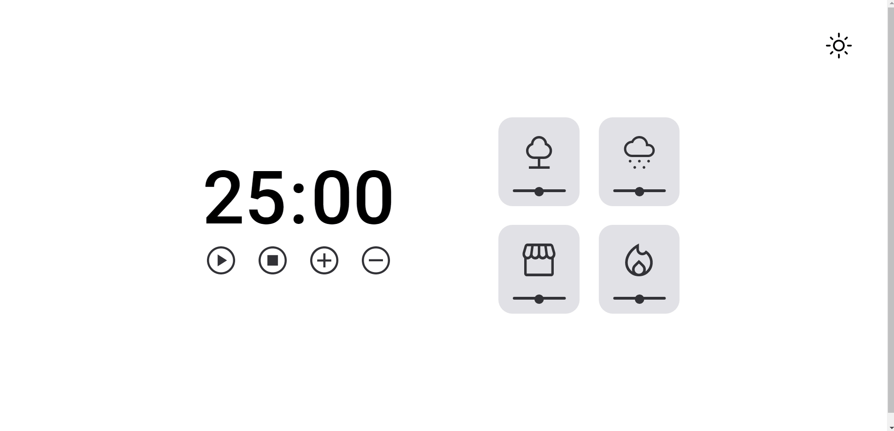

<h1 align="center">
    <a href="#"> Focus Timer - Pomodoro </a>
</h1>

	
  
	
  

  
	
  
    
  

  

<h4 align="center"> 
	 Status: Finished
</h4>

 <a href="#-about">About</a> •
 <a href="#-Features">Features</a> •
 <a href="#-layout">Layout</a> • 
 <a href="#-tech-stack">Tech Stack</a> • 
 <a href="#-author">Author</a> • 
 <a href="#-license">License</a>

## 💻 About

Focus timer is a pomodoro-style application created in factory pattern using ECMAScript modules.

With which you can stay more focused, in addition to being able to listen to relaxing sounds to facilitate conception

---

## ⚙️ Features

- [x] timer features:
   - [x] timer play button
   - [x] timer pause button
   - [x] timer stop button
   - [x] button increase time
   - [x] button decrease time

- [x] Sound features:
   - [x] play button
   - [x] pause button
   - [x] volume range
   - [x] stop automatically when click another
   - [x] sound at the end of time

- [x] Dark mode

---

## 🎨 Layout

### Web

  

### Mobile

 Responsive app

---

## 🛠 Tech Stack

The following tools were used in the construction of the project:

Project created in factory pattern using ECMAScript modules

#### **Project** 

-   HTML
-   CSS
-   Javascript
-   Ecmascript modules

---
## 🦸 Author

<a href="https://blog.rocketseat.com.br/author/exodo/">
  
  
 <b>Êxodo Gurgel</b></a>  🚀
  

 

---

## 📝 License

This project is under the license [MIT](./LICENSE).

Made with ❤️ by Êxodo Gurgel 👋🏽 [Get in Touch!](Https://www.linkedin.com/in/exodo-gurgel/)

---

